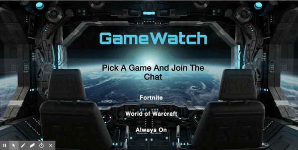

# PubNub-Project

This is an applications to view live Twitch streams for different games while chatting with others using PubNub CDN. With this applications, users can view live streams of their favorite game and chat with others about the game. Powered by PubNub and Twitch. (Futuristic Gamer Theme)

Note: New channels/games will be added monthly to ensure multiple options and keep up with recent releases. 

# Getting Started

Website Link: [GameWatch](https://mawais54013.github.io/PubNub-Project/)

The welcome page(below) has the main heading with a list of games that are available to view. With a custom button design, once clicked the user will be taken to the main page. 

The main page is where all the actions happens with viewing live stream from Twitch API and ChatEngine from PubNub SDK. Below is the gif example of myself viewing.

