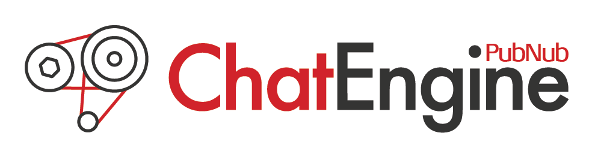

# PubNub-Project

This is an application to view live Twitch streams for different games while chatting with others using PubNub Chat Engine. With this application, users can view live streams of their favorite game and chat with each other while viewing. Powered by PubNub and Twitch. (Futuristic Game Viewer Theme)

Note: New channels/games will be added monthly to ensure multiple options and keep up with recent releases. 


# Getting Started

Just click the link below to view the project.

Website Link: [GameWatch](https://mawais54013.github.io/PubNub-Project/)

The welcome page has the main heading with a list of games that are available to view. With a custom button design, once clicked the user will be taken to the main page. 


The main page is where all the action happens with viewing live stream from Twitch API and using ChatEngine from PubNub SDK. Below is the gif example of myself viewing FIFA 19 with chatting example.


The main page shows an example of picking a channel to view and starting the live feed while chatting with others and checking the presence of people on the site. 

### Prerequisites

This is a web based site, it is responsive depending on browser size and templates fits when used via mobile phone but not intended for mobile viewing. Your can access the site from any interest browser including [Google Chrome](https://www.google.com/chrome/), [Firefox](https://www.mozilla.org/en-US/firefox/new/), or [Safari](https://www.apple.com/safari/). 

# Built With

* Javascript
* JQuery
* HTML
* CSS
* PubNub
* NPM
* Bootstrap
* Handlebars.js

# APIs and Libraries
* [PubNub](https://www.pubnub.com/)
    
    SDK/CDN for chat engine

* [Google Fonts](https://fonts.google.com/)

    Fonts for text

* [Twitch API](https://dev.twitch.tv/)

    Live streams and channels

* [Adobe Stock](https://stock.adobe.com/uk/)

    Background Images

* [Adobe Illustration](https://www.adobe.com/products/illustrator.html)

    Editing background images

* [Bootstrap](https://getbootstrap.com/)

    Main design and layout

# PubNub Chat Engine Feature



This project is set to demonstrate PubNub chat engine by connecting multiple users and having each of them communicate about a live stream. A Cross platform chatting system with presence indicator and real time message updates. Below are two important codes that help make new users while connecting them and creating new chats and organizing them to the chat history.

1) The following code sets up a new chat engine with my keys and creates the new person with a template of name, pic, and time. Then connects the user to the current chat; once the user is connected then all messages and other users will be connect to indicate their presence to others and be able chat with everyone in the room. 

```
init: function() {
    this.ChatEngine = ChatEngineCore.create({
        publishKey: userPubKey,
        subscribeKey: userSubKey
    }, {
        
        debug: true,
        globalChannel: 'chat-engine-desktop-demo'
    });
    // set up new person and connect them to current chat
    let newPerson = generatePerson(true);

    this.ChatEngine.connect(newPerson.uuid, newPerson);

    this.cacheDOM();
    // bind messages and users.
    this.ChatEngine.on('$.ready', function(data) {
        app.ready(data);
        app.bindMessages();
        app.bindUsers();
    });

}
```

2) The next mini set of code is a template for each chat the user writes. Each chat will contain the message, current time of the message, and the user that typed the message. Once all those information is contained then it is appended to the chat history. The chat history is sorted by time with the most recent chat shown first and the rest added below the current chat. 

```
 var context = {
        messageOutput: message.data.text,
        tt: messageJsTime.getTime(),
        time: app.parseTime(messageJsTime),
        user: message.sender.state
    };

    app.$chatHistoryList.append(template(context));

    // Sort messages in chat log based on their time
    app.$chatHistoryList
    .children()
    .sortDomElements(function(a,b){
        akey = a.dataset.order;
        bkey = b.dataset.order;
        if (akey == bkey) return 0;
        if (akey < bkey) return -1;
        if (akey > bkey) return 1;
    });
```

The chat is template is set up with Handlebars.js to append to the desktop.html once all information is received from the server, PubNub, and Twtich. 

Thank you for viewing my project below are my portfolio and GitHub.

# Author 

[Muhammad Awais](https://mawais54013.github.io/MAwais/)

[Github](https://github.com/mawais54013)